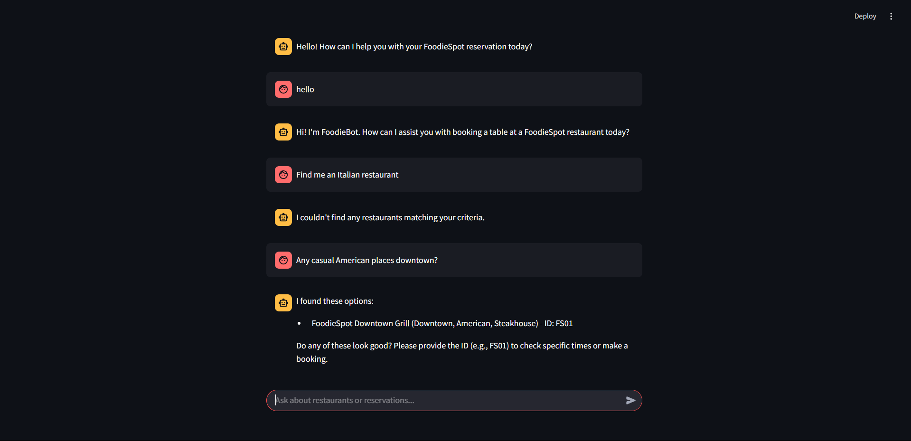
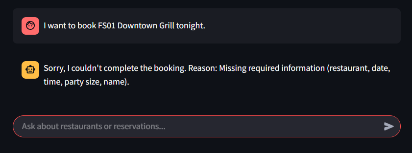
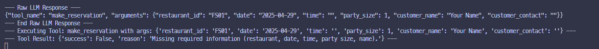
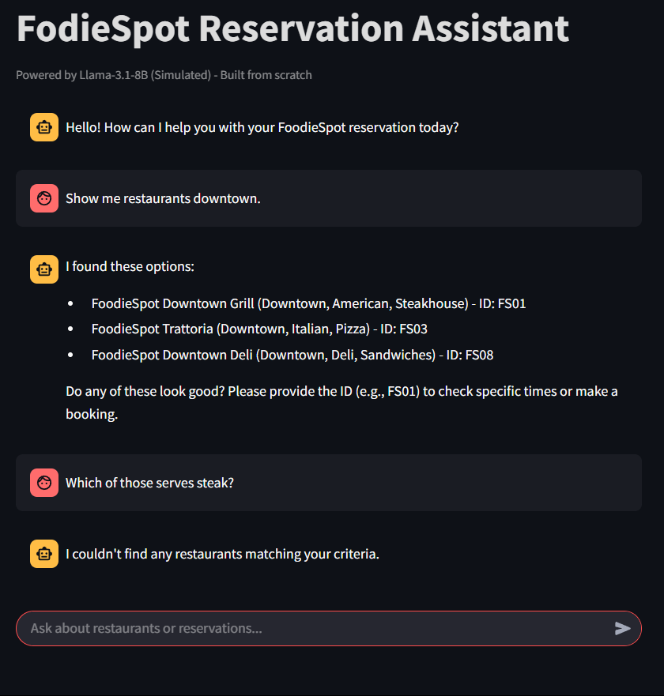
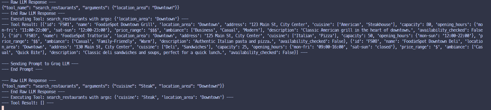
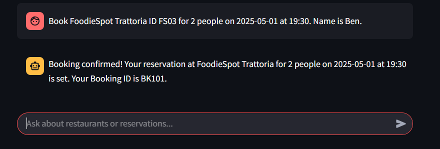
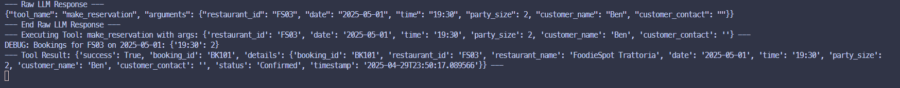
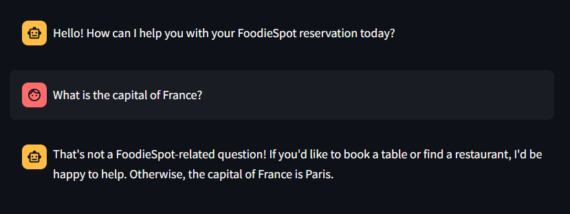

# FoodieSpot Conversational Reservation Agent

## Overview

This project implements a conversational AI agent designed to streamline the restaurant reservation process for "FoodieSpot," a fictional multi-location restaurant chain. The agent, accessible via a web interface, allows users to inquire about restaurants, get recommendations, check availability, and make bookings using natural language.

A key aspect of this project is demonstrating an understanding of **LLM-driven tool calling implemented from scratch**, without relying on high-level frameworks like LangChain. The agent uses the Groq API (with Llama 3.1 8B) to interpret user intent and determine when to call specific Python functions (tools) to interact with restaurant data and manage bookings.

## Features

* **Natural Language Interaction:** Understands user requests for reservations, recommendations, and information in conversational English.
* **Multi-Location Reservations:** Manages bookings across multiple simulated FoodieSpot locations.
* **Intelligent Recommendations:** Suggests restaurants based on cuisine, location, price, ambiance, and availability.
* **Real-time Availability Checks:** Simulates checking available seats based on capacity and existing bookings.
* **End-to-End Booking:** Handles the full reservation lifecycle from query to confirmation.
* **LLM-Powered Tool Calling (From Scratch):** Uses prompt engineering to make the LLM output structured JSON, indicating which backend function (tool) to call and with what arguments.
* **Web Interface:** Simple chat interface built with Streamlit.

## Tech Stack

* **Backend:** Python 3.x
* **LLM API:** Groq Cloud (using `llama3-8b-8192` model)
* **Web Framework:** Streamlit
* **API Key Management:** python-dotenv
* **Data Storage:** In-memory Python dictionaries (simulated database)

## Setup Instructions

1.  **Clone the Repository:**
    ```bash
    git clone <your-repository-url>
    cd <repository-directory>
    ```

2.  **Create a Virtual Environment:**
    ```bash
    python -m venv .venv
    ```

3.  **Activate the Virtual Environment:**
    * On Windows:
        ```bash
        .venv\Scripts\activate
        ```
    * On macOS/Linux:
        ```bash
        source .venv/bin/activate
        ```

4.  **Install Dependencies:**
    * First, create a `requirements.txt` file in the project root with the following content:
        ```txt
        streamlit
        groq
        python-dotenv
        ```
    * Then, install the requirements:
        ```bash
        pip install -r requirements.txt
        ```

5.  **Get Groq API Key:**
    * Sign up or log in at [https://console.groq.com/](https://console.groq.com/).
    * Navigate to the API Keys section and create a new secret key. Copy it.

6.  **Configure API Key:**
    * Create a file named `.env` in the root directory of the project.
    * Add your Groq API key to the `.env` file like this:
        ```
        GROQ_API_KEY=your_actual_api_key_here
        ```
    * **Important:** Ensure `.env` is added to your `.gitignore` file to prevent committing your secret key.

7.  **Run the Application:**
    ```bash
    streamlit run app.py
    ```
    This will start the Streamlit server, and the application should open in your default web browser.

[](https://groq.com)


## Prompt Engineering for Tool Calling

This project avoids using built-in tool-calling features of LLM frameworks or APIs to demonstrate the core principles from scratch. The interaction logic relies heavily on prompt engineering within `agent_logic.py`:

1.  **System Prompt:** A detailed system prompt defines the agent's persona ("FoodieBot"), its capabilities, and crucially, its required output format.
2.  **JSON Output Instruction:** The core instruction tells the LLM:
    > "If a tool can fulfill the request, respond ONLY with a single JSON object containing the 'tool_name' and 'arguments'. ... If no tool is needed, or you need to ask a clarifying question, respond ONLY with a single JSON object like: `{\"tool_name\": \"none\", \"response\": \"Your natural language response here.\"}` ... Respond only with the JSON object, nothing else."
3.  **Tool Descriptions:** The `TOOL_DESCRIPTIONS` string (generated in `tools.py`) is embedded directly into the system prompt. This tells the LLM exactly which tools are available (`search_restaurants`, `make_reservation`), what they do, and the specific parameters (name, type, description) they expect.
4.  **Context Injection:** The recent `conversation_history` is formatted and included in the prompt structure sent to the LLM, allowing it to understand follow-up questions and maintain context across turns.
5.  **Backend Parsing:** The Python backend (`process_user_message` function) expects the LLM's response to be a JSON string. It parses this JSON to determine whether to call a tool (based on `tool_name`) or deliver a direct response (if `tool_name` is "none").

This approach forces the LLM to act as a reasoning engine that translates natural language into a structured API call (represented by the JSON), which the backend code can then execute reliably.

## Example Conversations
### Scenario 1: General Chat


### Scenario 2: Handling Missing Information
 <br> 


### Scenario 3: Context History
 <br> 


### Scenario 4: Booking Tool
 <br> 


### Scenario 5: Out of Context Conversation



## Business Strategy Summary

This AI agent addresses key challenges faced by FoodieSpot:

  * **Problem:** High staff workload from manual bookings, inconsistent customer service, potential for booking errors, and missed upsell/data opportunities.
  * **Solution:** A conversational AI providing 24/7 booking, instant responses, consistent service, intelligent recommendations, and automated confirmations.
  * **Value Proposition:**
      * Improved Operational Efficiency (reduced staff time on calls).
      * Enhanced Customer Experience (convenient, instant booking).
      * Increased Revenue (reduced no-shows via reminders [future], potentially better table utilization via recommendations).
      * Valuable Data Insights (booking trends, customer preferences).
  * **Success Metrics:** Reduced staff booking time, increased AI booking volume, decreased booking errors, improved CSAT, higher table utilization.
  * **Vertical Expansion:** The core engine can be adapted as a SaaS solution for other restaurant chains or adjacent industries requiring appointment/time-slot booking (salons, clinics, hotels).

## Assumptions & Limitations

  * **LLM Reliability:** Assumes the LLM (Llama 3.1 8B via Groq) consistently follows the prompt instructions to output valid JSON for tool calls or direct responses. Sometimes deviations occur.
  * **Simulated Data:** Uses in-memory Python lists/dictionaries for restaurant and booking data. Data is not persistent and will be lost when the application stops.
  * **Basic Context:** Conversation history management is basic (appending to a string). Complex conversational might be hard.
  * **No User Authentication:** Doesn't identify or authenticate users. Bookings are made with just a name.
  * **Error Handling:** Basic error handling is implemented, but complex edge cases or API failures might not be handled gracefully.

## Future Enhancements

  * **Persistent Database:** Replace in-memory data with a proper database (e.g., PostgreSQL, SQLite using SQLAlchemy) for persistent storage of restaurants and bookings.
  * **Stateful Conversations:** Implement more robust conversation state management to handle complex dialogues and context better.
  * **User Accounts:** Add user authentication to track booking history and preferences.
  * **Notifications:** Integrate SMS or email APIs (like Twilio, SendGrid) to send booking confirmations and reminders.
  * **Advanced Recommendations:** Use embedding techniques on restaurant descriptions/reviews for semantic search and better recommendations based on nuanced queries.
  * **Deployment:** Containerize (e.g., Docker) and deploy to a cloud platform (e.g., Streamlit Cloud, Heroku, AWS).
  * **Waitlist Feature:** Implement functionality to add users to a waitlist if their desired slot is unavailable.
  * **POS Integration:** Explore potential integration with Point-of-Sale systems for seamless booking management.
  * **Refined Error Handling:** Improve handling of API errors, tool execution failures, and unexpected user inputs.

<!-- end list -->
